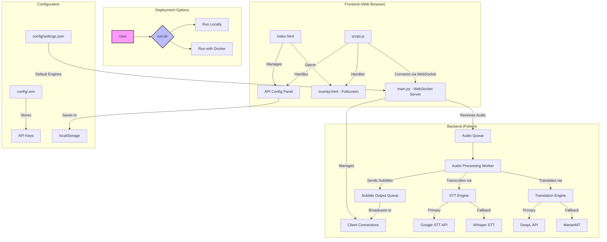

# Live Audio STT Translate

This project is a real-time, multi-client subtitle broadcasting platform. It transcribes live or pre-recorded Hindi audio to text and translates it to English, streaming the results to multiple connected devices simultaneously. It features dual-engine fallbacks for both STT and translation, a persistent overlay mode for display, and Docker support for easy deployment.

## Features

*   **Dual STT Engine with Fallback:**
    *   Primary: Google Cloud Speech-to-Text for high accuracy.
    *   Fallback: `faster-whisper` for offline or API-independent operation.
*   **Dual Translation Engine with Fallback:**
    *   Primary: DeepL API for high-quality translation.
    *   Fallback: `Helsinki-NLP/opus-mt-hi-en` (MarianMT) for local translation.
*   **WebSocket Multi-Client Sync:** Broadcasts subtitles to all connected clients in real-time, with timestamps.
*   **Persistent Overlay Frontend:** A dedicated, fullscreen overlay mode (`overlay.html`) for displaying subtitles on projectors or secondary screens.
*   **Frontend API Configuration:** Configure STT and translation engines and API keys directly from the web interface, with settings saved to `localStorage`.
*   **Docker Support:** Run the entire application (backend and frontend) in a containerized environment using `docker-compose`.
*   **Live and File-Based Processing:** Supports both live microphone input and audio file uploads.
*   **Resilience and Logging:** Services are configured to restart automatically, and the backend provides detailed logs, including fallback events.

## System Architecture



## File Structure

*   **`Dockerfile`**: Defines the container for the backend service.
*   **`docker-compose.yml`**: Orchestrates the backend and frontend services.
*   **`run.sh`**: Script to run the application either locally or with Docker.
*   **`config/`**:
    *   **`.env`**: Stores API keys for Google and DeepL.
    *   **`settings.json`**: Default configuration for STT and translation engines.
*   **`backend/`**:
    *   **`main.py`**: The core backend application.
    *   **`stt_engine.py`**: `STTEngine` class with Google/Whisper logic.
    *   **`translate_engine.py`**: `TranslationEngine` class with DeepL/MarianMT logic.
    *   **`requirements.txt`**: Python dependencies.
*   **`frontend/`**:
    *   **`index.html`**: Main control panel.
    *   **`overlay.html`**: Fullscreen subtitle display.
    *   **`script.js`**: Frontend logic for WebSocket, UI, and config.
    *   **`style.css`**: Styles for both pages.

## Setup and Installation

### Prerequisites

*   Docker and Docker Compose (for containerized deployment).
*   Python 3.10+ and `pip` (for local deployment).
*   API keys for Google Cloud Speech-to-Text and DeepL.

### Configuration

1.  **Create `.env` file:**
    Copy the contents of `.env.example` to `config/.env` and add your API keys.
    ```
    # config/.env
    GOOGLE_API_KEY="your_google_api_key"
    DEEPL_API_KEY="your_deepl_api_key"
    ```

### Running with Docker (Recommended)

This is the easiest way to run the application.

```bash
bash run.sh docker
```

The backend will be accessible at `ws://localhost:8768` and the frontend at `http://localhost:8100`.

### Running Locally

1.  **Set up a virtual environment:**
    ```bash
    python3 -m venv .venv
    source .venv/bin/activate
    ```
2.  **Install dependencies:**
    ```bash
    pip install -r backend/requirements.txt
    ```
3.  **Run the application:**
    ```bash
    bash run.sh
    ```

## Usage

1.  **Open the control panel:**
    Navigate to `http://localhost:8100`.
2.  **Configure APIs:**
    Use the API Configuration panel to select your desired STT and translation engines and enter your API keys. Click "Save Configuration".
3.  **Start Subtitling:**
    *   **Live:** Click "Start Listening".
    *   **File:** Choose a file and click "Upload Audio".
4.  **Open Overlay:**
    Click "Open Overlay" to launch the fullscreen subtitle display in a new window. This is ideal for a second monitor or projector.

## Technologies Used

*   **Backend:** Python, `websockets`, `google-cloud-speech`, `requests`, `faster-whisper`, `transformers`, `pydub`, `sounddevice`, `python-dotenv`.
*   **Frontend:** HTML5, CSS3, JavaScript, WebSockets API.
*   **Deployment:** Docker, Docker Compose.